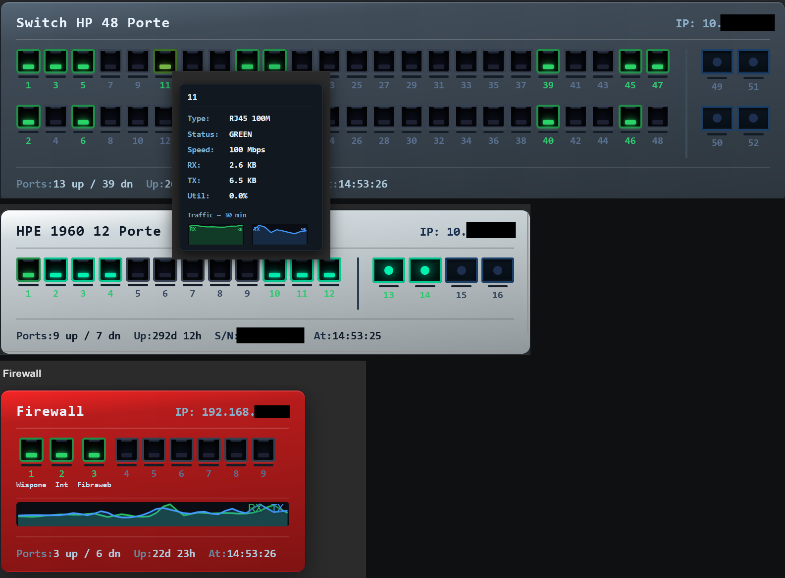

# Switch Visual Panel — Zabbix 7.x Dashboard Widget

A custom Zabbix dashboard widget that renders a visual network switch front panel with real-time port status, speed tiers, bandwidth sparklines, utilization bars, clickable ports, and a global traffic trend — all in a compact, dark-themed interface.



---

## Features

### Visual Panel
- **Physical switch layout** — RJ45 and SFP ports rendered as a front panel with deep-socket styling, LED indicators, and per-port utilization bars
- **Two-row port layout** — odd ports top row, even ports bottom row (like a real managed switch); optional single-row mode for smaller switches
- **SFP column** — separate column with larger port dimensions and fiber-style dot indicators
- **Zoom / scale** — resize the entire widget from 50% to 300%
- **Customizable chassis color** — interactive color picker; gradient (lighter highlight + darker shadow) is generated automatically
- **Auto-contrast text** — header, port labels, and summary text automatically switch to dark tones when the chassis background is a light color
- **Transparent widget background** — the Zabbix card chrome is hidden so only the chassis is visible

### Port Status & Speed Tiers

| LED color | Meaning |
|-----------|---------|
| **Cyan-green** (bright glow) | Up — 10 Gbps |
| **Bright green** | Up — 1 Gbps |
| **Olive green** (muted) | Up — 100 Mbps |
| **Amber** | Degraded — errors or high utilization |
| **Red** | Down / active trigger |
| **Dark grey** | Disconnected (`ifOperStatus` = 2) |

### Per-Port Information
- **Utilization bar** — 2 px bar below each port showing max(RX, TX) load (0–100%)
- **Hover tooltip** — type (RJ45/SFP + speed tier), status, speed, RX/TX in bytes, utilization %, error rate, "down for" duration, and a per-port RX/TX sparkline
- **Clickable ports** — click any port to open its Zabbix item history graph in a new tab

### Dashboard-Level Information
- **Global aggregate sparkline** — full-width RX (green) + TX (blue) trend chart showing total switch throughput over the configured window (no extra API calls — reuses per-port history)
- **Device summary bar** — ports up/down, error port count, uptime, model, serial, CPU %, temperature, last-refresh time
- **Active trigger badge** — ⚠ counter in the header with a tooltip listing every active Zabbix problem on the host

### Display Toggles
Each element below can be independently shown or hidden per widget instance:
- **Global sparkline** — hide to keep the chassis compact
- **Summary bar** — hide for a pure port-grid view
- **Port numbers** — hide for a cleaner, label-free look
- **Port labels / aliases** — hide when you only need status colours

### Configuration
- **Item key patterns** — wildcard patterns for all monitored items, compatible with any SNMP MIB layout
- **Port index offset** — for devices where SNMP indices don't start at 1 (e.g. firewalls with `ifInOctets[4096]` as port 1)
- **Auto-detect port count** — automatically reads the number of ports from matched items; manual count fields remain available and override auto-detect when needed (useful for firewalls/devices that expose VLANs and tunnels as interfaces)
- **Manual port aliases** — comma-separated `N=Label` overrides that take priority over SNMP aliases; range syntax `N-M=Label` assigns the same label to all ports in the range
- **Configurable sparkline window** — 5 to 360 minutes (default 30)
- **Multi-instance safe** — all dynamic CSS rules are scoped to a per-instance class so multiple switch widgets on the same dashboard never interfere with each other

---

## Requirements

| Component | Version |
|-----------|---------|
| Zabbix | 7.0 or 7.2+ |
| PHP | 8.0+ |
| Browser | Any modern browser (CSS `:has()` used for background transparency) |

---

## Installation

1. Copy the `switch_visual/` folder to your Zabbix modules directory:
   ```
   /usr/share/zabbix/modules/switch_visual/
   ```

2. In the Zabbix frontend go to **Administration → General → Modules** and click **Scan directory**.

3. Enable the **Switch Visual Panel** module.

4. Add the widget to any dashboard — search for **Switch Visual Panel** in the widget picker.

---

## Configuration Fields

### Host

| Field | Description |
|-------|-------------|
| Host | The Zabbix host representing the switch |

### Item Key Patterns

Wildcard patterns (`*`) match the interface index in item keys. Adjust to match your host's actual item keys.

| Field | Default | Description |
|-------|---------|-------------|
| BW In item pattern | `ifInOctets[*]` | Inbound bandwidth (bytes/sec after Zabbix delta preprocessing) |
| BW Out item pattern | `ifOutOctets[*]` | Outbound bandwidth (bytes/sec) |
| Status item pattern | `ifOperStatus[*]` | Operational status (`1`=up, `2`=down) |
| Speed item pattern | `ifHighSpeed[*]` | Speed in Mbps (RFC 2863); also accepts bps values |
| Errors In item pattern | `ifInErrors[*]` | Inbound error counter |
| Errors Out item pattern | `ifOutErrors[*]` | Outbound error counter |
| Interface alias pattern | *(empty)* | Optional SNMP alias/description per interface |

### Layout

| Field | Default | Description |
|-------|---------|-------------|
| RJ45 ports | 24 | Number of RJ45 ports to display (ignored when auto-detect is on) |
| SFP ports | 2 | Number of SFP/uplink ports — always manual, even with auto-detect |
| Port rows (1 or 2) | 2 | `1` = single row (e.g. 8-port), `2` = staggered dual row |
| Invert row order | Off | Swaps top/bottom row assignment — even ports top, odd ports bottom (matches Huawei and similar) |
| Sequential rows | Off | First half of ports on top row, second half on bottom (e.g. 1–24 top, 25–48 bottom) instead of odd/even split |
| Zoom (50–300%) | 100 | Scale factor for the entire widget visual |

### Appearance

| Field | Default | Description |
|-------|---------|-------------|
| Chassis color | `#404c58` | Click the color swatch to open a color picker. The widget generates a 3-stop gradient automatically. Text colors adapt for readability. |

### Port Mapping

| Field | Default | Description |
|-------|---------|-------------|
| Auto-detect port count | Off | When enabled, counts all items matching the BW-In pattern and uses that as the port total. Turn off for devices that expose VLANs or tunnels as interfaces. |
| Port index start | 1 | First SNMP interface index. Set to `4096` if your device's first port is `ifInOctets[4096]`. |
| Port aliases | *(empty)* | Comma-separated overrides, e.g. `1=Uplink, 3=ESX01, 5=Core, 10-24=Access` — range syntax assigns the same label to a span of ports |

### Device Summary Items

Optional exact item keys (no wildcard) for the summary bar.

| Field | Example key |
|-------|-------------|
| Uptime item key | `sysUpTime.0` |
| Serial number item key | `entPhysicalSerialNum.1` |
| Model item key | `sysDescr.0` |
| CPU % item key | `hrProcessorLoad.1` |
| Temperature item key | `ciscoEnvMonTemperatureValue.1` |

### Display Toggles

| Field | Default | Description |
|-------|---------|-------------|
| Show summary bar | On | Toggles the Ports/Uptime/Model/CPU/Temp row at the bottom |
| Show port numbers | On | Toggles the numeric label under each port socket |
| Show port labels / aliases | On | Toggles the alias text under each port number |
| Show global traffic sparkline | On | Toggles the aggregate RX+TX trend bar |

### Sparkline

| Field | Default | Description |
|-------|---------|-------------|
| Sparkline window (minutes) | 30 | Historical window for per-port tooltips and global sparkline (5–360 min) |

---

## Compatibility Notes

- **`ifHighSpeed` vs `ifSpeed`**: The widget auto-normalises both. `ifHighSpeed` returns Mbps (`1000` for 1 Gbps); `ifSpeed` returns bps (`1000000000` for 1 Gbps). Both display correctly.
- **Non-standard SNMP indices**: Use *Port index start* to map physical port numbers when device indices don't begin at 1.
- **Auto-detect on firewalls / multi-context devices**: Devices that expose sub-interfaces (VLANs, tunnels, loopbacks) as SNMP interfaces will produce an inflated port count. Keep auto-detect off and enter the physical port count manually.
- **Multiple widgets**: Each widget instance generates a unique CSS scope based on its host ID, so changing chassis color or zoom on one widget never affects another.
- **Transparent background**: Uses a CSS `:has()` selector to remove the Zabbix widget card background. Effectiveness depends on the active Zabbix theme.

---

## Project Structure

```
switch_visual/
├── manifest.json                    # Module metadata, action registration, JS asset
├── Widget.php                       # Module entry point
├── assets/
│   └── js/
│       └── class.widget.js          # JS widget class — handles port click → history graph
├── actions/
│   ├── WidgetView.php               # Main controller: resolves fields, runs DataFetcher, builds response
│   └── WidgetSparkline.php          # AJAX endpoint: returns per-port RX/TX history series as JSON
├── includes/
│   ├── DataFetcher.php              # All Zabbix API calls: items, history, triggers, aliases, summary, sparklines
│   └── WidgetForm.php               # Widget configuration field definitions
└── views/
    ├── widget.edit.php              # Configuration form view
    ├── widget.view.php              # Dashboard rendering (CSS + PHP CDiv tree, SVG sparklines)
    └── widget.sparkline.php         # Sparkline AJAX response view
```

---

## Version History

### 1.4.3
- Two new port layout toggles (both default off — existing behaviour unchanged):
  - **Invert row order**: swaps which row odd/even ports appear on (even ports top, odd ports bottom — matches Huawei and some other vendors)
  - **Sequential rows**: places ports 1–N/2 on the top row and N/2+1–N on the bottom row instead of the staggered odd/even split (e.g. 1–24 top, 25–48 bottom)
  - The two toggles combine: sequential + inverted puts the second half on top

### 1.4.2
- Port alias uniform spacing: all port wrappers fixed to 32px wide so alias length never affects inter-port spacing
- Port alias range syntax: `4-6=VLAN1` now expands to ports 4, 5 and 6 — no need to repeat the same label for consecutive ports

### 1.4.1
- Fixed utilization bar calculation: speed was compared in Mbps against bytes/sec traffic, making the bar always show 0% or 100%. Now correctly normalized to bytes/sec
- Port alias truncation: long aliases now truncate with ellipsis (`…`) at the port edge; hover the alias text to see the full name
- Global sparkline legend now shows peak RX and TX bandwidth for the sparkline window (e.g. `RX 1.2MB/s  TX 856KB/s`)
- Fixed undefined variable error when adding a new widget before a host is selected
- Fixed broken HTML in sparkline legend (`<i>` self-closing tag) that caused RX/TX labels to render in wrong position

### 1.4.0
- Auto-detect port count: reads matched item count from Zabbix; manual fields still override when needed
- Display toggles: individually show/hide summary bar, port numbers, port labels, global sparkline
- Global sparkline toggle added to widget configuration

### 1.3.0
- Interactive color picker for chassis color (replaces hex text input)
- Auto-contrast text: header, labels, and summary text switch to dark tones on light chassis backgrounds
- Clickable ports: click any port to open its Zabbix history graph in a new tab
- Configurable sparkline window (5–360 minutes, default 30)
- Error port counter in summary bar (counts ports with non-zero error rate)
- Global aggregate sparkline: full-width RX+TX trend for the whole switch (reuses fetched history, zero extra API calls)
- Multi-instance CSS scoping: dynamic rules are namespaced per host so multiple switch widgets on the same dashboard never interfere
- Deeper port socket visual: multi-stop gradient, inner shadow, notch pseudo-element, LED at socket bottom

### 1.2.0
- Three distinct speed-tier colors (100M / 1G / 10G)
- Configurable chassis color (custom hex gradient)
- Port index start/offset for non-standard SNMP indices
- RX/TX tooltip units corrected (`B` suffix)
- Transparent widget background via CSS `:has()`
- SFP ports enlarged
- Speed display bug fixed (bps vs Mbps normalization)

### 1.1.0
- Side-by-side RX/TX sparklines in tooltip with peak scale labels
- Per-port utilization bar
- Tooltip redesign (dark card, auto-scaled bandwidth, speed tier, "down for" duration)
- Active trigger warning badge in header
- Alias placeholder always reserved (no layout shift on hover)
- Single/double port row toggle
- Error item patterns configurable
- Summary bar with render timestamp

### 1.0.0
- Initial release: visual switch panel, port status, basic tooltips, SFP support

---

## License

MIT — see [LICENSE](LICENSE) for details.
